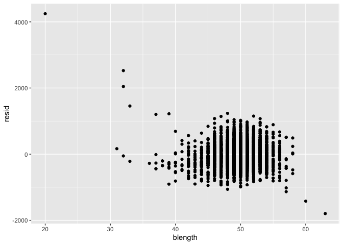
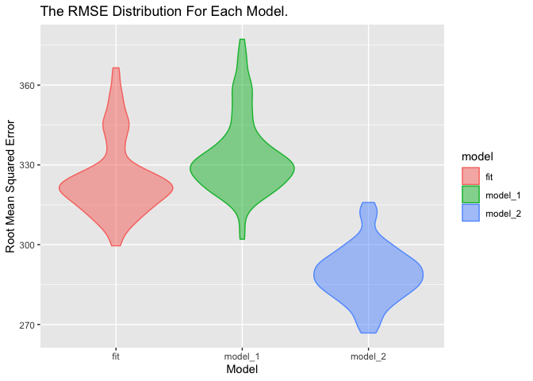
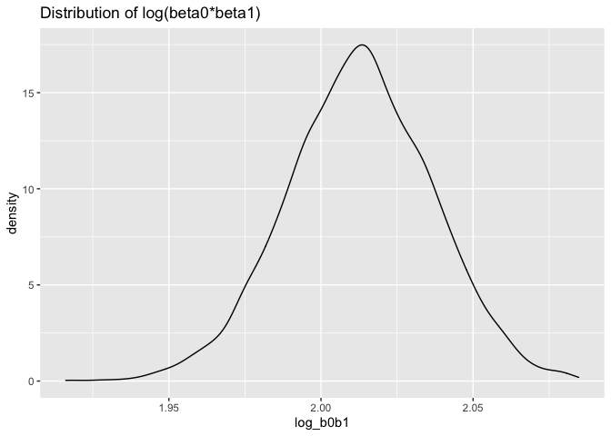

p8105\_hw6\_wc2788
================
Wen Cheng
11/29/2021

## Problem 1

### Load and clean data

``` r
birthweight <- read_csv("birthweight.csv") %>%
  janitor::clean_names() %>%
#convert numeric to factor
  mutate(babysex = factor(babysex,
                          levels = c(1, 2),
                          labels = c("male", "female")),
         frace = factor(frace, 
                        levels = c(1, 2, 3, 4, 8, 9), 
                        labels = c("White", "Black", "Asian", "Puerto Rican", "Other", "Unknown")),
         malform = factor(malform, 
                          levels = c(0, 1),
                          labels = c("absent", "present")),
         mrace = factor(mrace, 
                        levels = c(1, 2, 3, 4, 8), 
                        labels = c("White", "Black", "Asian", "Puerto Rican", "Other")))
```

    ## Rows: 4342 Columns: 20

    ## ── Column specification ────────────────────────────────────────────────────────
    ## Delimiter: ","
    ## dbl (20): babysex, bhead, blength, bwt, delwt, fincome, frace, gaweeks, malf...

    ## 
    ## ℹ Use `spec()` to retrieve the full column specification for this data.
    ## ℹ Specify the column types or set `show_col_types = FALSE` to quiet this message.

``` r
 #check for missing data
sum(is.na(birthweight))
```

    ## [1] 0

There are `nrow(birthweight)` observations and `ncol(birthweight)`
variables in this dataset, and no missing value.

### Propose a regression model

``` r
fit = lm(bwt ~ babysex + blength + delwt + fincome + frace + mrace + wtgain, data = birthweight) 
summary(fit)
```

    ## 
    ## Call:
    ## lm(formula = bwt ~ babysex + blength + delwt + fincome + frace + 
    ##     mrace + wtgain, data = birthweight)
    ## 
    ## Residuals:
    ##     Min      1Q  Median      3Q     Max 
    ## -1671.3  -212.0    -5.0   203.2  4064.5 
    ## 
    ## Coefficients:
    ##                     Estimate Std. Error t value Pr(>|t|)    
    ## (Intercept)       -3553.0681    96.1684 -36.946  < 2e-16 ***
    ## babysexfemale        -7.2516     9.9143  -0.731 0.464557    
    ## blength             126.5506     1.9166  66.028  < 2e-16 ***
    ## delwt                 2.3398     0.2517   9.296  < 2e-16 ***
    ## fincome               0.7738     0.2075   3.730 0.000194 ***
    ## fraceBlack          -22.6665    54.8940  -0.413 0.679690    
    ## fraceAsian           -7.2809    82.4237  -0.088 0.929614    
    ## fracePuerto Rican   -71.0238    53.0818  -1.338 0.180965    
    ## fraceOther           20.7090    88.1182   0.235 0.814209    
    ## mraceBlack         -139.1683    54.7188  -2.543 0.011014 *  
    ## mraceAsian          -26.6589    85.4185  -0.312 0.754982    
    ## mracePuerto Rican   -12.2677    53.5414  -0.229 0.818782    
    ## wtgain                3.4632     0.5006   6.918 5.27e-12 ***
    ## ---
    ## Signif. codes:  0 '***' 0.001 '**' 0.01 '*' 0.05 '.' 0.1 ' ' 1
    ## 
    ## Residual standard error: 324.4 on 4329 degrees of freedom
    ## Multiple R-squared:    0.6,  Adjusted R-squared:  0.5988 
    ## F-statistic:   541 on 12 and 4329 DF,  p-value: < 2.2e-16

### Make plot

``` r
birthweight %>% 
  modelr::add_residuals(fit) %>% 
  modelr::add_predictions(fit) %>% 
  ggplot(aes(x = pred, y = resid)) + 
  geom_point()
```

<!-- -->

### Compare model

``` r
# One using length at birth and gestational age as predictors (main effects only)
model_1 <- lm(bwt ~ blength + gaweeks, data = birthweight)

# One using head circumference, length, sex, and all interactions (including the three-way interaction) between these
model_2 <- lm(bwt ~ bhead * blength * babysex, data = birthweight)
```

### Cross Validation

``` r
#CV using modelr
cv_df = 
  crossv_mc(birthweight, 100) %>% 
  mutate(
    train = map(train, as_tibble),
    test = map(test, as_tibble)
  )
#fit models and obtain RMSEs using mutate + map & map2
cv_df = 
  cv_df %>% 
  mutate(
   fit = map(train, ~lm(bwt ~ babysex + blength + delwt + fincome + frace + mrace + wtgain, data = .x)),
   model_1 = map(train, ~lm(bwt ~ gaweeks + blength, data = .x)),
   model_2 = map(train, ~lm(bwt ~ bhead * blength * babysex, data = .x))) %>% 
  mutate(
    rmse_fit = map2_dbl(fit, test, ~rmse(model = .x, data = .y)),
    rmse_model_1 = map2_dbl(model_1, test, ~rmse(model = .x, data = .y)),
    rmse_model_2 = map2_dbl(model_2, test, ~rmse(model = .x, data = .y))
  )
```

### Make plot

``` r
cv_df %>% 
  select(starts_with("rmse")) %>%              
  pivot_longer(
    everything(),
    names_to = "model", 
    values_to = "rmse",
    names_prefix = "rmse_") %>% 
  mutate(model = fct_inorder(model)) %>%       
  ggplot(aes(x = model, 
             y = rmse, 
             color = model, 
             fill = model)) + 
  geom_violin(alpha = 0.5) +
  labs(x = "Model",
       y = "Root Mean Squared Error",
       title = "The RMSE Distribution For Each Model") 
```

<!-- --> The
model\_2 has the smallest RMSE, so it is the best fit in these three
models. model\_1 has the highest RMSE, the fit model has high RMSE
compared with model\_2, so these two are not best fit.

## Problem 2

### Load data

``` r
weather_df = 
  rnoaa::meteo_pull_monitors(
    c("USW00094728"),
    var = c("PRCP", "TMIN", "TMAX"), 
    date_min = "2017-01-01",
    date_max = "2017-12-31") %>%
  mutate(
    name = recode(id, USW00094728 = "CentralPark_NY"),
    tmin = tmin / 10,
    tmax = tmax / 10) %>%
  select(name, id, everything())
```

    ## Registered S3 method overwritten by 'hoardr':
    ##   method           from
    ##   print.cache_info httr

    ## using cached file: ~/Library/Caches/R/noaa_ghcnd/USW00094728.dly

    ## date created (size, mb): 2021-12-04 00:46:05 (7.616)

    ## file min/max dates: 1869-01-01 / 2021-12-31

``` r
#set a seed for reproducibility
set.seed(1234)

#draw 5000 bootstrap samples
bootstrap_samples =
  weather_df %>% 
  bootstrap(n = 5000) %>% 
  mutate(
    models = map(strap, ~lm(tmax ~ tmin, data = .x) ),
    log_beta = map(models, broom::tidy),
    r_squared =map(models, broom::glance)) %>% 
    select(.id, r_squared, log_beta) %>% 
    unnest(r_squared, log_beta)
```

    ## Warning: unnest() has a new interface. See ?unnest for details.
    ## Try `df %>% unnest(c(r_squared, log_beta))`, with `mutate()` if needed

### 95% CI for R Squared

``` r
bootstrap_samples %>%
  summarize(
    lower_limit = quantile(r.squared, c(0.025)),
    upper_limit = quantile(r.squared, c(0.975))
  ) %>%
  knitr::kable()
```

| lower\_limit | upper\_limit |
|-------------:|-------------:|
|     0.893665 |    0.9276334 |

### Make R Squared plot

``` r
bootstrap_samples %>%
  ggplot(aes(x = r.squared)) +
  geom_density() +
  labs(
    title = "Distribution of R Squared"
  )
```

<!-- -->

### 95% CI for log(beta0\*beta1)

``` r
bootstrap_samples %>%
  select(.id, term, estimate) %>%
  pivot_wider(
    names_from = "term",
    values_from = "estimate"
  ) %>%
  janitor::clean_names() %>%
  mutate(
    log_b0b1 = log(intercept*tmin)
  ) %>%
  summarize(
    lower_limit = quantile(log_b0b1, c(0.025)),
    upper_limit = quantile(log_b0b1, c(0.975))
  ) %>%
  knitr::kable()
```

| lower\_limit | upper\_limit |
|-------------:|-------------:|
|      1.96508 |        2.059 |

### Make log(beta0\*beta1) plot

``` r
bootstrap_samples %>%
  select(.id, term, estimate) %>%
  pivot_wider(
    names_from = "term",
    values_from = "estimate"
  ) %>%
  janitor::clean_names() %>%
  mutate(
    log_b0b1 = log(intercept*tmin)
  ) %>%
  ggplot(aes(x = log_b0b1)) + 
  geom_density() +
  labs(
    title = "Distribution of log(beta0*beta1)"
  )
```

<!-- -->
